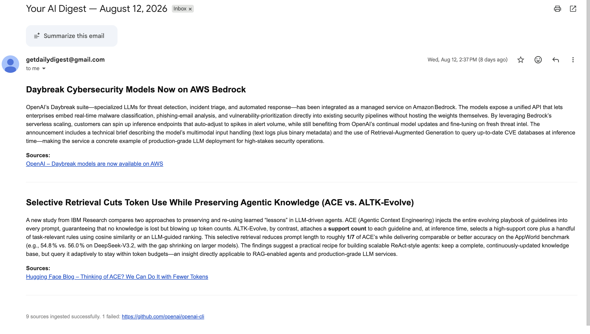

# DailyDigest-AI

DailyDigest-AI is a multi-user, AI-powered digest application. Users subscribe to YouTube channels and blog/article sources, maintain a personal interest profile, and receive a curated HTML digest by email during scheduled runs.

The web application also supports source management, source readability checks, AI-assisted source suggestions, digest pausing, article browsing, and on-demand digest previews.

## Sample output

Here's an example of a generated digest email:



## How it works

1. **Ingestion** fetches items from YouTube feeds and blog/article feeds.
2. **Cleaning** extracts usable content and removes boilerplate.
3. **Summarization** generates an independent summary for each article.
4. **Assembly** uses the user's interest profile to select, combine, and order relevant summaries into a personalized digest.
5. **Delivery** renders the digest as HTML and sends it through Gmail SMTP during scheduled runs.

Sources are globally deduplicated by canonical URL. A source is shared across users, while each user's subscription and display name are stored in `user_source_aliases`.

## Stack

| Layer | Technology |
|---|---|
| Backend | Python 3.12+, FastAPI, Uvicorn |
| Frontend | Next.js App Router, React |
| Database | PostgreSQL, SQLAlchemy, Alembic |
| LLM provider | Groq (`openai/gpt-oss-20b` for article summaries, `openai/gpt-oss-120b` for digest assembly) |
| Search | Exa, optional for interest-based source suggestions |
| Email | Gmail SMTP with an App Password |
| Authentication | Firebase Authentication in the frontend; Firebase ID-token verification for account deletion |
| Package managers | `uv` for Python, `npm` for the frontend |
| Local database | Docker Compose |

## Project structure

```text
app/
  api/                 FastAPI application, authentication, and API routes
    routes/            users, sources, articles, health, and pipeline endpoints
  digest/              Article summarization, digest assembly, and digest models
  email/               Digest HTML rendering and Gmail SMTP delivery
  ingestion/           Blog/article and YouTube ingestion adapters
  llm/                 Provider abstraction and Groq/OpenAI/Anthropic adapters
  models/              SQLAlchemy models and processing-status definitions
  processing/          Content cleaning and token estimation
  prompts/             Default interest-profile prompt
  recommendations/     Candidate-source ranking and fallback recommendations
  search/              Search-provider abstraction and Exa integration
  utils/               URL validation, suggestion validation, and shared helpers
  runner.py            Scheduled and manual pipeline orchestration
frontend/
  src/app/             Dashboard, sources, articles, preferences, and pipeline pages
  src/components/     Shared UI components, including source suggestions
  src/context/        Firebase authentication context
  src/lib/             API client and Firebase setup
docker/                Local PostgreSQL Docker Compose configuration
migrations/            Alembic environment and database migrations
tests/                 Automated tests
docs/                  Architecture and pipeline documentation
main.py                CLI entry point for the digest pipeline
server.py              Local FastAPI development entry point
```

## Local setup

### 1. Install dependencies

```bash
git clone https://github.com/Devanshu070/DailyDigest-AI.git
cd DailyDigest-AI
uv sync
```

### 2. Configure the backend

Copy the example environment file and fill in the values:

```bash
cp .env.example .env
```

Required backend variables:

| Variable | Purpose |
|---|---|
| `DATABASE_URL` | PostgreSQL connection string |
| `GROQ_API_KEY` | Groq API access for summarization and assembly |
| `GMAIL_SENDER` | Gmail address used to send digests |
| `GMAIL_APP_PASSWORD` | Gmail App Password, not the account password |
| `DIGEST_RECIPIENT_EMAIL` | Default CLI/manual-run target email |

Optional variables:

| Variable | Purpose |
|---|---|
| `EXA_API_KEY` | Enables Exa-backed source discovery; suggestions degrade gracefully without it |
| `FIREBASE_PROJECT_ID` | Enables backend verification for account deletion |

Never commit `.env`, API keys, Gmail credentials, or Firebase service-account credentials.

### 3. Start PostgreSQL and apply migrations

```bash
docker compose -f docker/docker-compose.yml up -d
uv run alembic upgrade head
```

The database migrations create the user, source, article, digest, and subscription tables. Apply migrations before starting the backend or running the pipeline against a new database.

### 4. Start the backend

```bash
uv run python server.py
```

The local API is available at `http://localhost:8000`.

- OpenAPI: `http://localhost:8000/docs`
- ReDoc: `http://localhost:8000/redoc`
- Health: `http://localhost:8000/api/v1/health`

### 5. Configure and start the frontend

Create `frontend/.env.local` using the Firebase web-app configuration from Firebase Console:

```dotenv
NEXT_PUBLIC_FIREBASE_API_KEY=...
NEXT_PUBLIC_FIREBASE_AUTH_DOMAIN=your-project.firebaseapp.com
NEXT_PUBLIC_FIREBASE_PROJECT_ID=your-project
NEXT_PUBLIC_FIREBASE_STORAGE_BUCKET=...
NEXT_PUBLIC_FIREBASE_MESSAGING_SENDER_ID=...
NEXT_PUBLIC_FIREBASE_APP_ID=...

# Leave empty locally; Next.js proxies /api requests to localhost:8000.
NEXT_PUBLIC_API_URL=
```

Then run:

```bash
cd frontend
npm install
npm run dev
```

The frontend is available at `http://localhost:3000`. In production, set `NEXT_PUBLIC_API_URL` to the deployed FastAPI URL.

## Running the pipeline

### Scheduled mode

```bash
uv run python main.py
```

Scheduled mode:

- processes active users whose configured UTC `digest_time` is due;
- skips users whose scheduled delivery is paused;
- fetches missing source content, reuses cached articles, and builds the digest;
- sends the email through Gmail SMTP;
- updates both `last_digest_at` and `last_scheduled_digest_at` after successful delivery.

### Manual preview mode

```bash
uv run python main.py --manual --email user@example.com
```

Manual mode is intended for an on-demand preview from the web UI, API, or CLI. It uses a rolling 24-hour window, generates the digest HTML, calls the preview callback when used through the API, and does **not** send email. A successful manual run updates `last_digest_at` but never updates `last_scheduled_digest_at`, so it does not suppress the next scheduled delivery.

The API starts manual runs asynchronously:

```text
POST /api/v1/pipeline/run?manual=true&email=user@example.com
GET  /api/v1/pipeline/run-state
```

The pipeline state is held in memory by the API process. The Pipeline page restores the active run state when revisited while that backend process is still running.

## Web features

- **Dashboard:** digest status, latest articles, and source overview.
- **Sources:** add or remove blog/article and YouTube sources, set a personal display name, check one source, or check all sources.
- **Suggested sources:** generate source recommendations from the user's interest profile and select recommendations before adding them.
- **Articles:** browse subscribed-source articles and inspect summaries when available.
- **Preferences:** edit interests, configure the daily UTC delivery time, pause/resume scheduled delivery, and delete the PostgreSQL account.
- **Pipeline:** trigger a manual run and view its progress and generated HTML preview.

Firebase Authentication manages frontend sign-in. Application users, subscriptions, preferences, sources, and articles remain in PostgreSQL; the backend uses the Firebase ID token specifically to authorize account deletion.

## GitHub Actions delivery

`.github/workflows/daily_digest.yml` runs the scheduled pipeline every eight hours:

```yaml
schedule:
  - cron: "0 */8 * * *"
```

The workflow invokes `uv run python main.py`, so it uses scheduled delivery semantics and can send email. `workflow_dispatch` runs that same scheduled command immediately; it is not the manual preview mode used by the web UI.

Configure these repository secrets under **Settings → Secrets and variables → Actions**:

| Secret | Purpose |
|---|---|
| `DATABASE_URL` | Hosted PostgreSQL connection string |
| `GROQ_API_KEY` | Groq API key |
| `GMAIL_SENDER` | Gmail sender address |
| `GMAIL_APP_PASSWORD` | Gmail App Password |
| `DIGEST_RECIPIENT_EMAIL` | Default recipient used by the CLI configuration |

The workflow also runs `uv run alembic upgrade head` before the pipeline. Use a hosted PostgreSQL URL; a local Docker database is not reachable from GitHub-hosted runners.

## Tests and checks

Run the available automated tests with:

```bash
uv run pytest
```

For frontend checks:

```bash
cd frontend
npm run lint
npm run build
```

## Documentation

- [`docs/architecture_final.md`](docs/architecture_final.md) — architecture diagrams
- [`docs/dev_architecture.md`](docs/dev_architecture.md) — developer module and pipeline reference
- [`docs/example_pipeline.md`](docs/example_pipeline.md) — worked pipeline example
- [`docs/data_flow.md`](docs/data_flow.md) — end-to-end data flow
- [`docs/implementation.md`](docs/implementation.md) — implementation notes

## License

MIT
