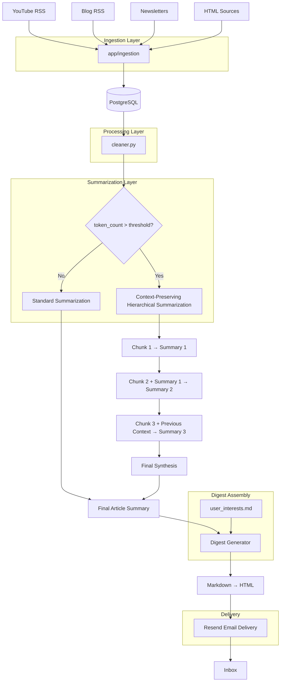
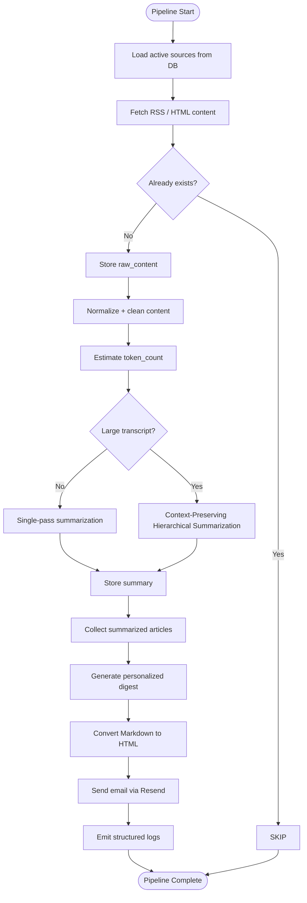
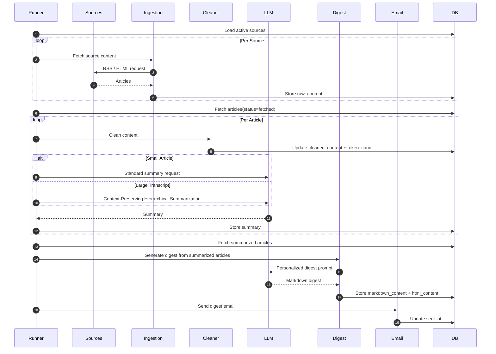
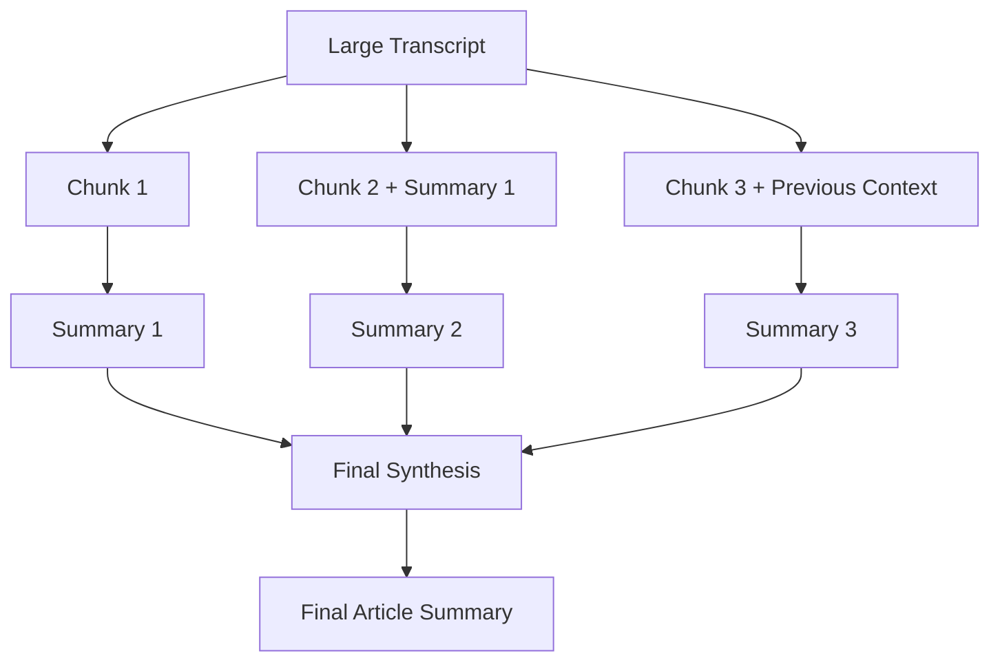
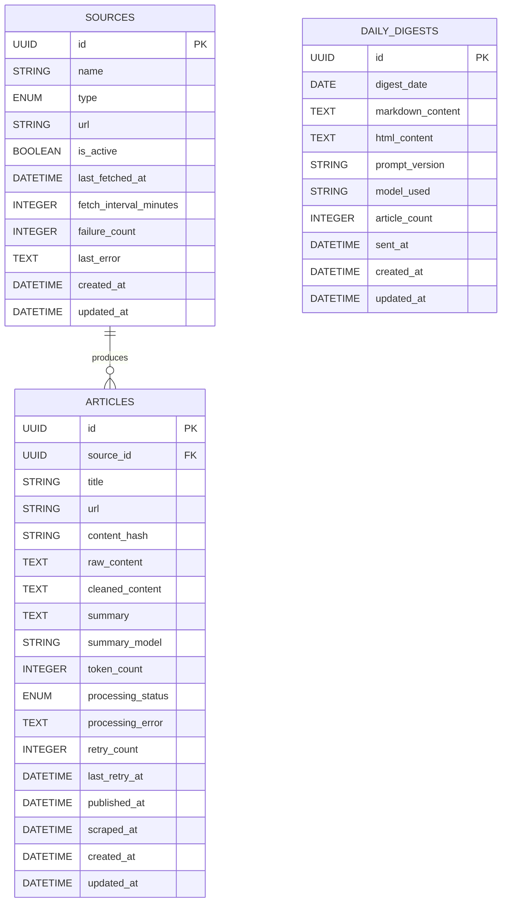
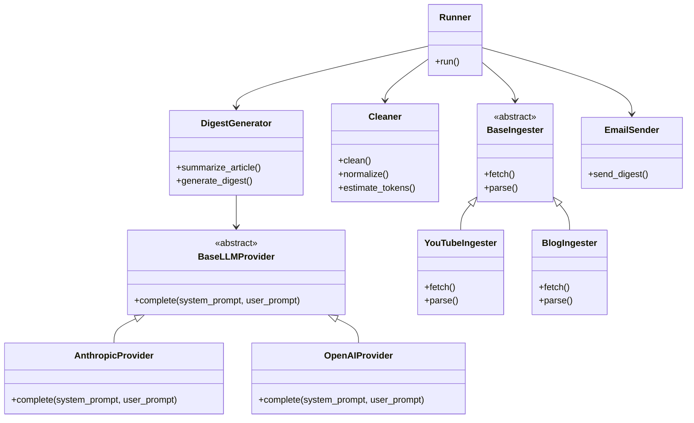
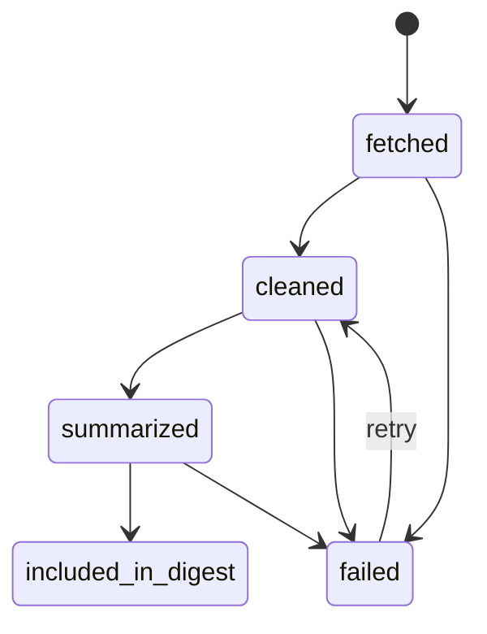
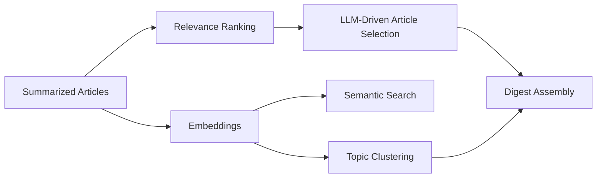

# DailyDigest-AI — Architecture Diagrams

---

# 1. High-Level System Architecture

---

# 2. Runtime Pipeline Flowchart

---

# 3. Sequence Diagram — End-to-End Pipeline

---

# 4. Context-Preserving Hierarchical Summarization Flow

---

# 5. Database ER Diagram

---

# 6. Class Diagram

---

# 7. Processing State Machine

---

# 8. Future Extensibility Architecture

